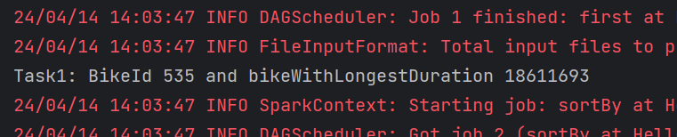
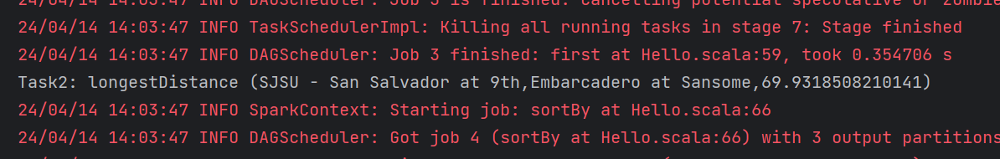
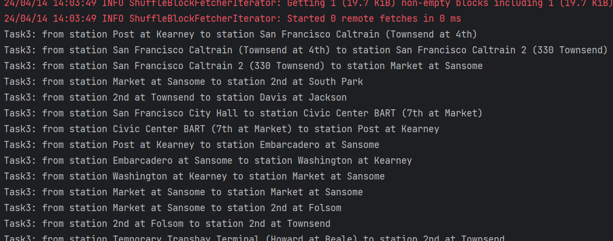
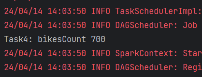
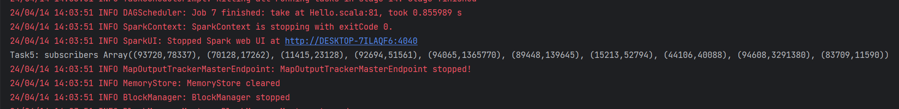

Скрины запусков

1. Найти велосипед с максимальным временем пробега.
   

2. Найти наибольшее геодезическое расстояние между станциями
   

3. Найти путь велосипеда с максимальным временем пробега через станции
   

4. Найти количество велосипедов в системе
   

5. Найти пользователей потративших на поездки более 3 часов
   
