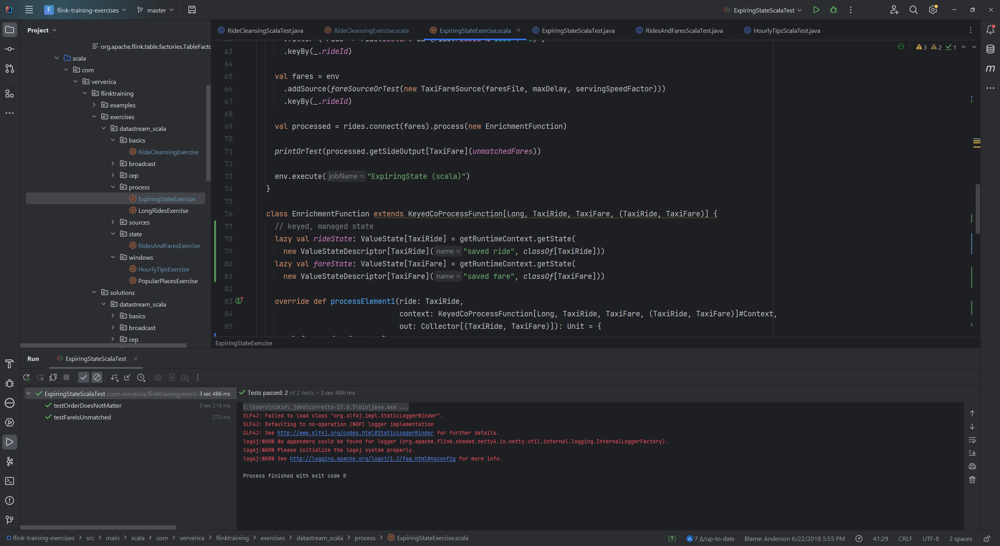

Часть содержимого файла nycTaxiFares


```
1,2013000001,2013000001,2013-01-01 00:00:00,CSH,0,0,21.5
2,2013000002,2013000002,2013-01-01 00:00:00,CSH,0,0,7
3,2013000003,2013000003,2013-01-01 00:00:00,CRD,2.2,0,13.7
4,2013000004,2013000004,2013-01-01 00:00:00,CRD,1.7,0,10.7
```

Часть содержимого файла nycTaxiRides


```
6,START,2013-01-01 00:00:00,1970-01-01 00:00:00,-73.866135,40.771091,-73.961334,40.764912,6,2013000006,2013000006
11,START,2013-01-01 00:00:00,1970-01-01 00:00:00,-73.870834,40.773769,-73.792358,40.771759,1,2013000011,2013000011
55,START,2013-01-01 00:00:00,1970-01-01 00:00:00,-73.87117,40.773914,-73.805054,40.68121,1,2013000055,2013000055
```

Скрины успешно пройденных тестов:





